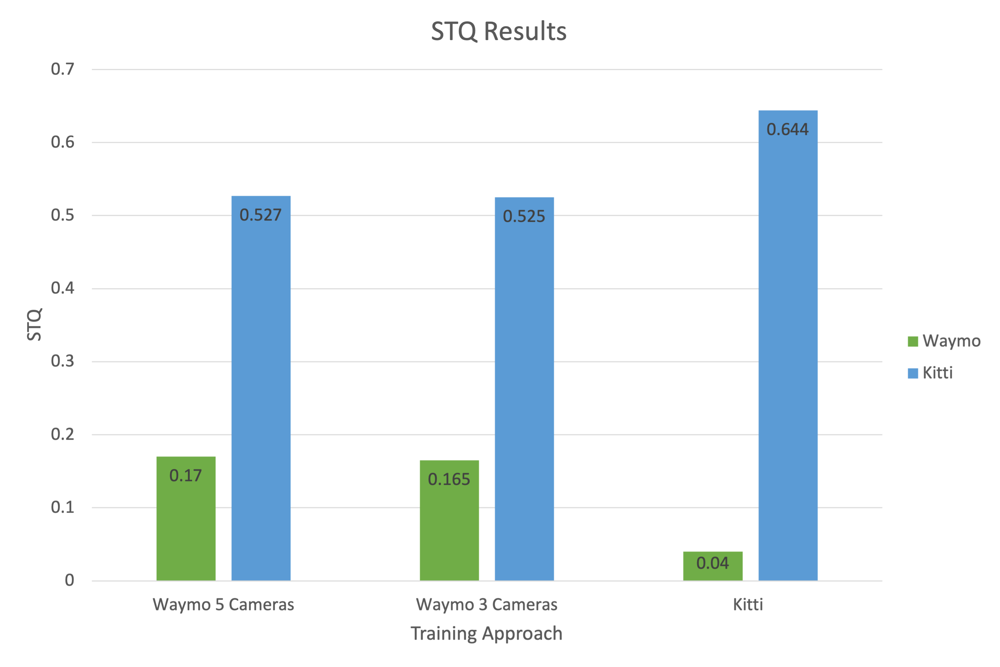
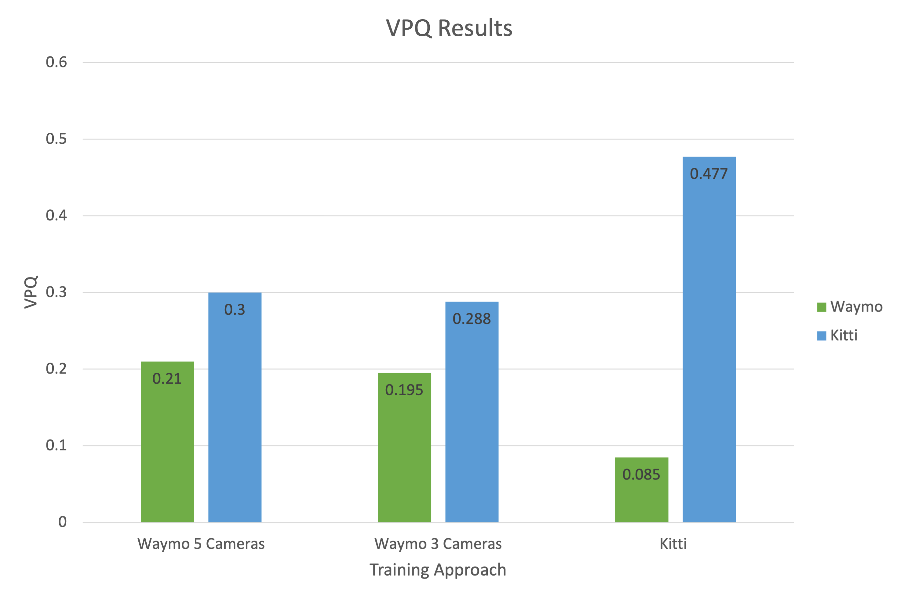

# Results 

In this file, we present quantitative and qualitative results on the two contributions that we have implemented.

## Contribution 1: FPN layers increase

The case studies are explained in the README.md, we remind the meaning of the different cases here:

Case A - Baseline.
Case B - Modified pretraining.
Case C - Modified training.
Case D - Modified training and pre-training.

| Approach            | Dataset         | STQ       |  VPQ      |
|---------------------|-----------------|-----------|-----------|
| Case A              | Kitti-step      | 0.644     | 0.447     |
| Case B              | Kitti-step      | 0.652     | 0.440     |
| Case C              | Kitti-step      | 0.655     | 0.456     |
| Case D              | Kitti-step      | 0.650     | 0.450     |

From the results, we can see that the increase in FPN layers improved both the STQ and VPQ over the baseline for all three cases B, C, D. This proves our hypothesis that a larger feature space, up to P8, is more effective than a conventional space stopped at P5. 
It also seems that increasing the layers for the Video-K-Net model during training has a higher impact than increasing it for the K-Net model during pretraining. This is better seen from case D where the modification was applied to both training and pretraining but the results were slightly lower than when the modification was only applied to the training. Therefore, we can conclude that, for the highest performance, it is enough to increase the FPN layers for the Video-K-Net model training only.

The following videos are examples of case C on the test dataset.

## Contribution 2: Waymo dataset training

As explained in the README.md, training the model on Waymo dataset was done once with all 5 camera views, and once with only 3 camera views (front, front-left and front-right).

| Approach            | Test Dataset    | STQ       |  VPQ      |
|---------------------|-----------------|-----------|-----------|
| 5 camera views      | Kitti-step      | 0.527     | 0.300     |
| 3 camera views      | Kitti-step      | 0.525     | 0.288     |
| 5 camera views      | Waymo           | 0.170     | 0.211     |
| 3 camera views      | Waymo           | 0.165     | 0.195     |
| Kitti - Case A      | Waymo           | 0.04      | 0.085     |

These results could also be represented in the followign charts:

It is worth noting that training and validation data size was fixed for every different approach (around 10k and 5k respectively). 

Considering training on 5 camera views versus 3 camera views, removing the side camera resulted in a very slight decrease in performance. Therefore, they do not significantly affect the STQ and VPQ results. This is because the side views sees side buildings most of the time. They are definitely useful in general autonomous driving tasks in situations where a car is exiting a street on the side. However, for a video panoptic segmentation task that tracks cars and pedestrians, these views do not have any cars or pedestrian most of the time. 

Considering the generalisation of the model trained on Waymo and Kitti, training on Waymo and testing on Kitti shows much higher performance than training on Kitti and testing on Waymo. 

It is worth noting that when the model is trained on Waymo, its test results on Kitti is higher than its test results on Waymo. This could be due to the fact that Waymo is a much more challenging dataset specially because it is much more diverse. The testing Waymo dataset includes foggy videos and at night. Although the training dataset has similar examples, it may have required a larger train data size for the model to learn these conditions. Therefore, we hypothesize that increasing the train data size of Waymo could lead to much better results than Kitti. 

The following videos show an example of the model trained on waymo once from the Waymo test dataset and once from the Kitti test dataset. 

Waymo test sequence:

Kitti test sequence:

## Conclusion

To summarise, incresing the FPN layers to 8 instead of 5 enhances the performance of the current state-of-the-art. Our experiments, also, show that this increasing the FPN layers in the train shows more significant improvement than the pretraining. Moreover, the Waymo dataset proves to be more challenging as a dataset than kitti. That is because when the model is trained on Waymo, it performs better in test time on Kitti than on Waymo. This could be related to the fact that the Waymo dataset has much more diverse scenes including different weather conditions and time of the day. Therefore, it is possible that the model needs to train on a larger subset of the Waymo dataset that includes all the different scenarios. Finally, removing the side cameras in this subset of the Waymo dataset did not have significant effect on the performance; this can be attributed to the fact that in this subset of the data, the side cameras did not include a lot of cars and pedestrians. 